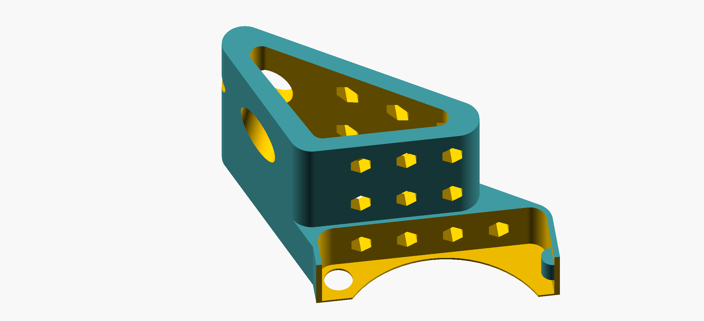
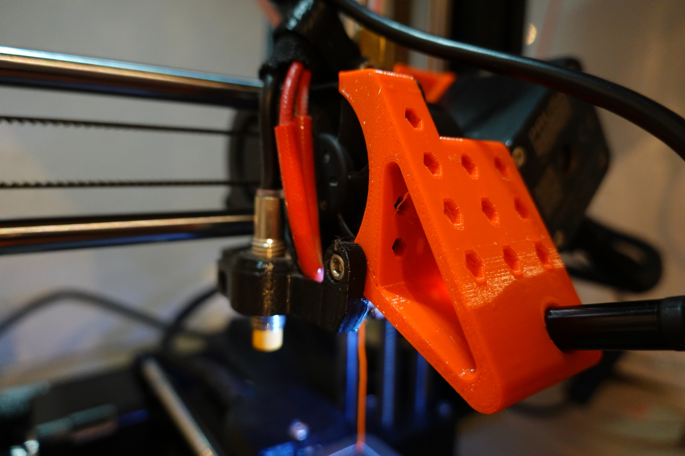
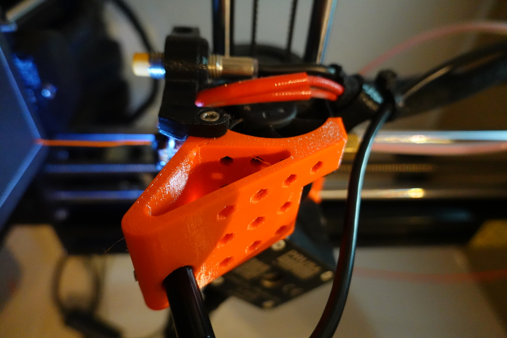
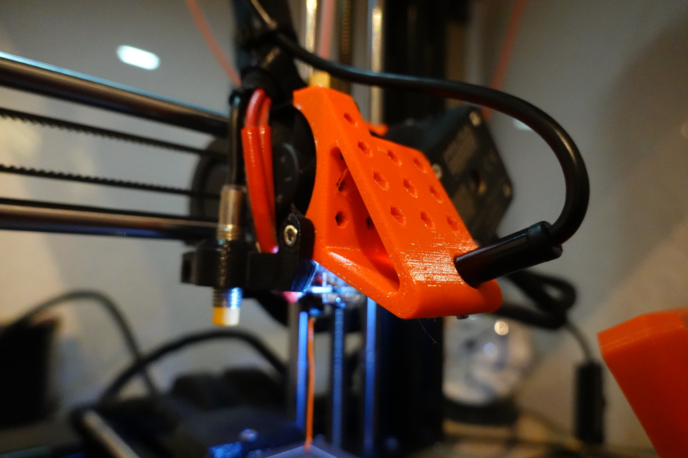
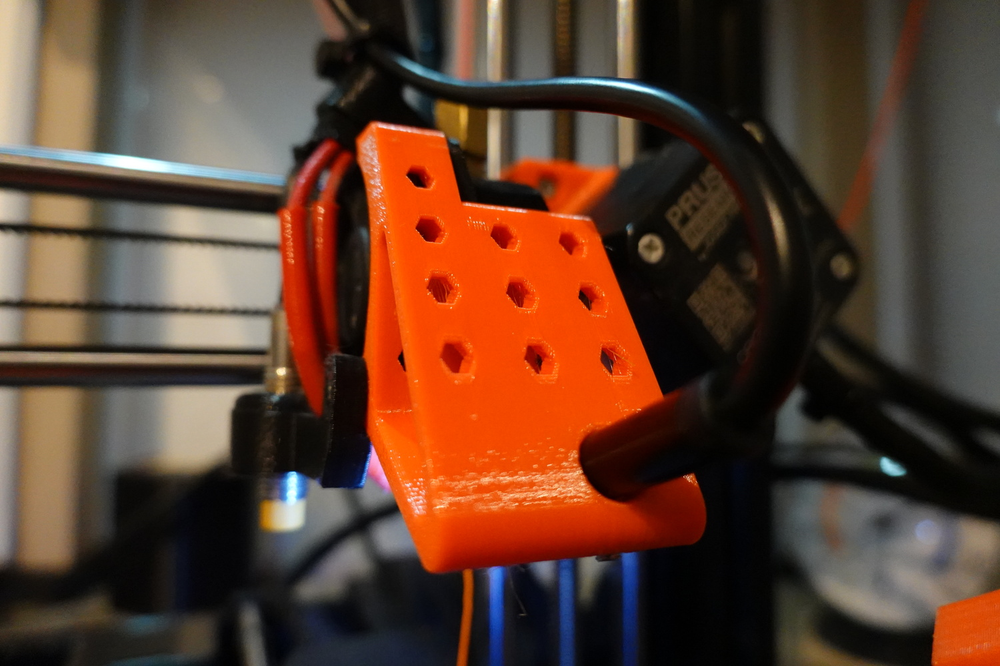
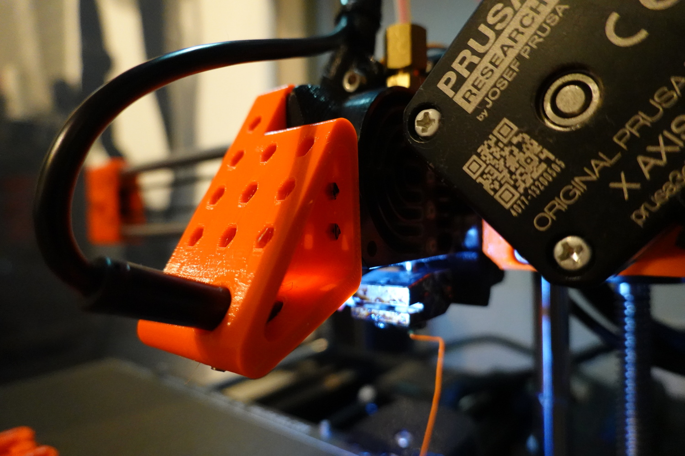
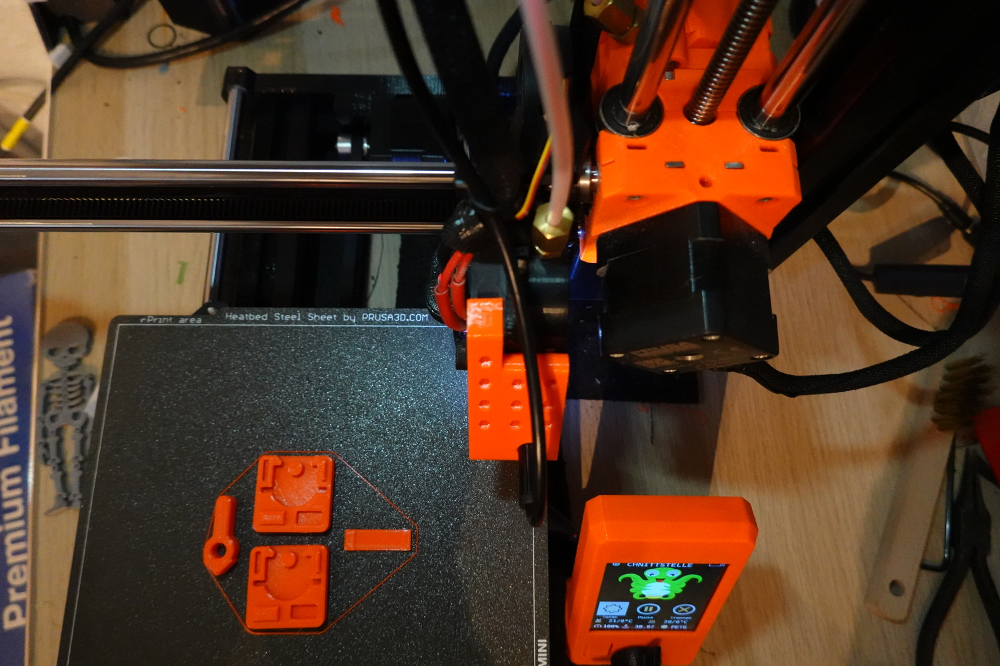
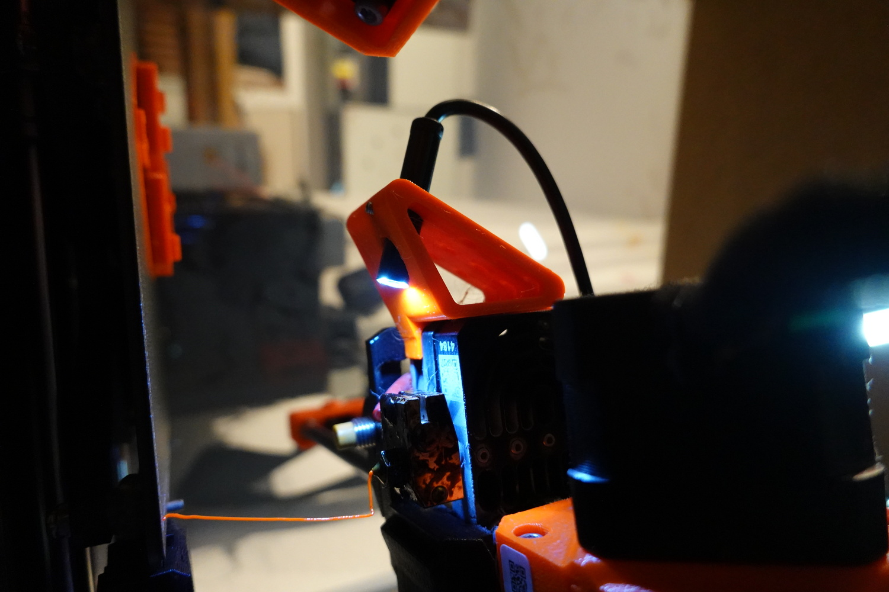

# Prusa Mini Nozzle Cam Mount

__Version 1__

This is a easy printable nozzle camera holder for Prusa Mini.

Parts needed:
- this Prusa Mini(+) Nozzle Camera Holder
- M3 screw (M3x4 or something like that, I used one without a head and with a hex insert)
- USB Endoscope Camera (M5, M6, M7, M8, M9, M10)

# Video

# LICENSE

<dl>
 Dieses Werk ist lizenziert unter einer <a rel="license" href="http://creativecommons.org/licenses/by/4.0/">Creative Commons Namensnennung 4.0 International Lizenz</a>.
</dl>

<dl>
 This work is licensed under a <a rel="license" href="http://creativecommons.org/licenses/by/4.0/">Creative Commons Attribution 4.0 International License</a>.
</dl>
